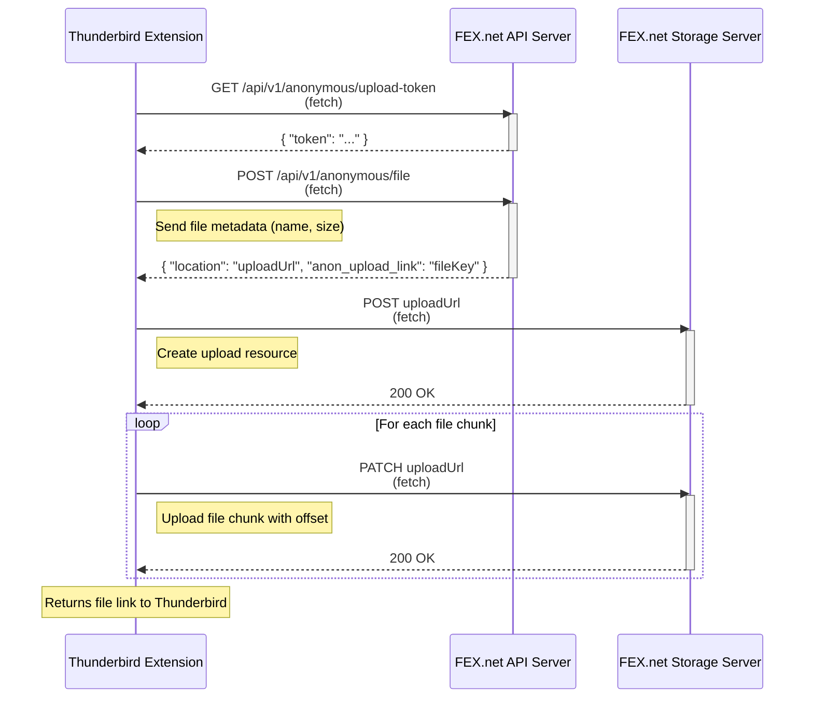

# FEX.net File Link Webextension for Thunderbird

Easily upload large attachments anonymously to [FEX.net](https://fex.net/support) using the [cloudFile/filelink API](https://thunderbird-webextensions.readthedocs.io/en/latest/cloudFile.html) — fast, secure, and hassle-free.

## How it Works

This extension integrates with Thunderbird's Filelink feature, first introduced in Thunderbird v64, to handle large attachments. Instead of attaching a large file directly to an email, Thunderbird uploads the file to FEX.net and inserts a link into the email body.

FEX.net provides free temporary file storage with [Privacy Policy](https://fex.net/privacy-policy). Files are stored anonymously and are available via a public link for a limited time. This extension does not use cookies for tracking anonymous uploads.

### Upload Process

The following diagram illustrates the data exchange between the Thunderbird extension and the FEX.net REST API during the file upload. Each network request is performed using `fetch` in `background.js`.

